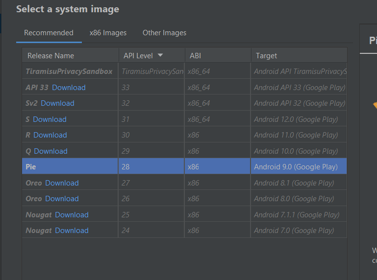

# Prueba de app mobile 
###### Para la prueba se utilizó Lippia
###### https://github.com/Crowdar/lippia-mobile-sample-project

## Requisitos:
+ JDK: https://docs.oracle.com/en/java/javase/index.html
+ Android Studio & SDK tools: https://developer.android.com/studio
+ Maven: https://maven.apache.org/download.cgi
+ Appium server: https://github.com/appium/appium-desktop


#Pasos para ejecutar el proyecto

Una vez instalado Android studio accedemos al 'device manager'


Seleccionamos el dispositivo que vamos a utilizar. En este caso el proyecto esta configurado para Pixel

Damos a siguiente y seleccionamos la version de andriod 9 (Descargar si es necesario)

Completamos la creacion del dispisitivo virtual

Ejecutamos el dispositivo con el boton "play" dentro del device manager


Ejecutar Appium server y presionar 'Edit configurations' para validar y configurar la ubicacion del JDK/SDK

Configurado el sdk presionar 'Star server'

Configurar la ubicacion del apk en el pom.xml dentro del proyecto 
```                
<crowdar.appLocation>
    C:\\\\Users\\\\Estudio\\\\Downloads\\\\lippia-mobile-sample-project-master\\\\sample_apk\\\\Android-NativeDemoApp-0.4.0.apk
</crowdar.appLocation>
```

###Instalar dependencias y ejecutar el proyecto: 

```mvn clean install```

## Reporte:
```
├── lippia-mobile-sample-project
    ├── docs
    |   └── ...
    ├── src
    |   └── ...
    ├── target
    |   └── AventReport
    |       └── index.html
    └── ...

```
Ejecutar html desde un navegador. Se visualizara los features ejecutados y los resultados de los mismos


